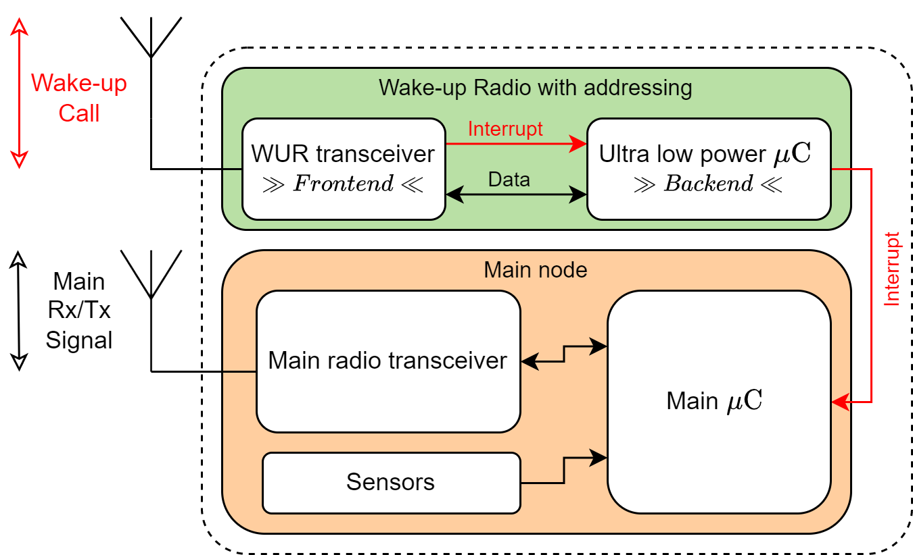
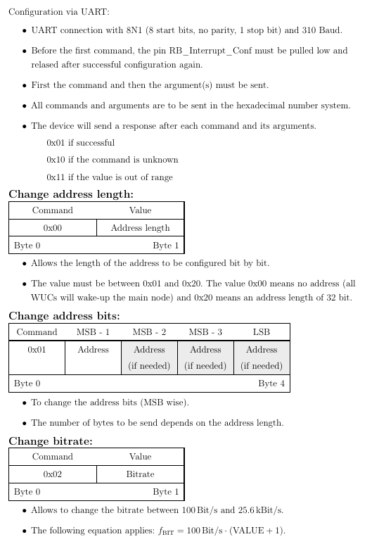

# Wake-up Receiver (WURx)
This project includes the main PCB design as well as the software for a semi-active Wake-up Receiver with addressing capabilities.

The WURx is the green part of the overall architecture shown in the following figure.
More details are found in the associated publications ([HotWire], [STFO]).

 

## Features
This implementation is an experimental solution for research purposes and has the following functions:

- Different comparators in the frontend are possible (TLV3691, LPV7215, TS881)
- Configurable address
- Configurable address length (0 to 32 bit)
- Configurable bitrate (100 to 25.6 kbps, with automatic clock adjustment)
- Backend supports deep-sleep and Switch (by) Transistors Fully Off (STFO) mode (see [STFO])

## Requirements
- Hardware
  - The PCBs (frontend and backend) designed in KiCad (see folder pcb/)
  - A transmitter (e.g. a Software Defined Radio like the USRP B210 with GNU Radio) is needed to send a Wake-up Call
- To program the $\mu C$ (a PIC16LF1823)
    - [MPLAB&reg; X IDE](https://www.microchip.com/en-us/tools-resources/develop/mplab-x-ide#)
    - [MPLAB&reg; XC8 C-Compiler](https://www.microchip.com/en-us/tools-resources/develop/mplab-xc-compilers/downloads-documentation#XC8)
    

## UART interface

[HotWire]: https://paper1
[STFO]: https://paper2